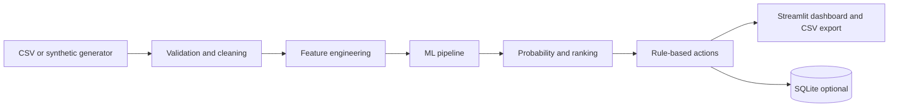

# LeadPilot — AI Sales Intelligence

A portfolio-ready, local-first Streamlit application for estimating B2B lead conversion, explaining scores, and translating probabilities into sales follow-up actions.

> **Dataset:** 100% synthetic, generated from explicitly designed business relationships. No real customer information is included. Scores are illustrative and **not validated for live sales operations**.

## Business problem
Sales representatives have limited time and inconsistent signals from CRM activity. LeadPilot helps prioritize the queue by combining source, segment, product interest, website activity, recency, and purchase history.

## Features
- Executive dashboard: lead volume, conversion rates, expected conversions, source and industry trends.
- Individual lead scoring with local what-if factor explanations.
- Bulk CSV scoring, ranking, validation and export.
- Configurable follow-up recommendations, separate from the statistical model.
- Optional SQLite persistence for bulk prediction history.
- Reproducible training and held-out evaluation with three candidate models.

## Architecture


## Installation and run
Requires Python 3.10+ (recommended 3.11).
```bash
git clone https://github.com/aditi-choudhury/leadpilot-sales-ai-ml.git
cd leadpilot-sales-ai-ml
python -m venv .venv
# Activate: Windows: .venv\Scripts\activate ; macOS/Linux: source .venv/bin/activate
pip install -r requirements.txt
python -m src.generate_data
python -m src.train_model
streamlit run app/app.py
```
The generator creates `data/leads.csv`; training writes `models/pipeline.joblib` and `models/metrics.json`. All generated artifacts are ignored by Git. For tests: `python -m pytest -q`.

## Model methodology
Data is split 75/25 stratified using seed 42. All imputation, one-hot encoding, scaling, and feature engineering are inside fitted pipelines. Logistic regression, random forest, and histogram gradient boosting are compared by three-fold stratified ROC-AUC **only on training data**. The best CV model wins, unless logistic regression is within 0.015 ROC-AUC. The test set is used once to report ROC-AUC, average precision, accuracy, precision, recall, F1, Brier score and confusion matrix. Accuracy alone is insufficient for uneven conversion outcomes; ranking metrics help prioritize outreach, and Brier measures probability quality. Threshold-based precision/recall depend on a default 0.50 classification threshold, which is independent of sales-priority thresholds.

## Actual evaluation results
See `models/metrics.json` after running `python -m src.train_model` (generated locally, not committed). Metrics are computed rather than invented; results depend on installed dependency versions and input data.

## Explainability
Local factors use a **perturbation/what-if** method: each feature is individually replaced with a documented reference value, and the predicted probability difference is shown. This is not SHAP, not causal, and can be sensitive to correlated features. The local explanations are decision aids only.

## Rules and business impact
High ≥0.70: call within 24h; if last interaction >21 days, re-engage urgently. Medium ≥0.40: nurture. Low <0.40: automated follow-up. Thresholds in `config/settings.py`, action rules in `src/predict.py`. This can improve prioritization and effort allocation **in principle**; uplift has not been measured or A/B tested.

## Data dictionary
CSV requires these fields: `lead_source, industry, customer_segment, company_size, geography, website_visits, sales_calls, email_engagement, demo_requested, days_since_last_interaction, previous_purchases, previous_revenue, campaign_response, lead_age_days, product_interest`. `lead_id` is optional for scoring but required for SQLite storage. `converted` is required only for training. Email engagement is a number from 0 to 1; demo and campaign response are binary. Numeric missing values are imputed during inference; categorical missing values become `Unknown`. Invalid or absent required columns raise a clear error. Deduplication uses lead_id when present.

## Structure
`app/` Streamlit UI; `src/` generator, preprocessing, features, training, prediction, database; `config/` paths and thresholds; `sql/` schema and examples; `tests/` pytest; `data/` generated CSV and SQLite; `models/` trained pipeline and metrics.

## Limitations and production hardening
Synthetic data encodes assumptions, so synthetic test metrics do not demonstrate real-world predictive performance. Predictions may not be calibrated on real customers. Historical features must be captured **before** conversion; audit timestamp availability to avoid leakage. Local SQLite has no authentication or concurrency controls. Uploaded data is processed locally; do not deploy publicly with confidential data without authentication, authorization, retention controls, encryption and auditing. Loading joblib files is unsafe from untrusted sources. Additional work: CRM integration, real outcomes, monitoring for drift and bias, automated retraining, probability calibration, A/B tests, sales-capacity optimization, PostgreSQL/SQLAlchemy migration, Salesforce/HubSpot integration, and customer lifetime value modeling.

## License
MIT.
